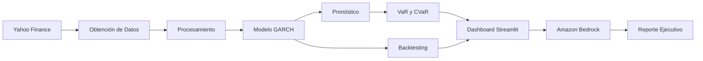

<p align="center">

# SGR-IA
### Plataforma Inteligente para la Gestión de Riesgo Financiero

)" alt="Banner del Proyecto"/>

</p>

<p align="center">


</p>

<p align="center">

**Inteligencia Artificial • Econometría • Ciencia de Datos • Gestión de Riesgo Financiero**

</p>

---

# Índice

- [Descripción del Proyecto](#-descripción-del-proyecto)
- [Problema que Resuelve](#-problema-que-resuelve)
- [Nuestra Solución](#-nuestra-solución)
- [Demostración](#-demostración)
- [Aplicación en Producción](#-aplicación-en-producción)
- [Características Principales](#-características-principales)
- [Arquitectura General](#-arquitectura-general)
- [Tecnologías Utilizadas](#-tecnologías-utilizadas)

---

# Descripción del Proyecto

**SGR-IA (Sistema de Gestión de Riesgo con Inteligencia Artificial)** es una plataforma desarrollada para apoyar la toma de decisiones financieras mediante técnicas de econometría, análisis cuantitativo e Inteligencia Artificial Generativa.

La aplicación integra modelos de volatilidad **GARCH(1,1)** con servicios de **Amazon Bedrock**, permitiendo transformar resultados estadísticos complejos en reportes ejecutivos comprensibles para analistas financieros, inversionistas y responsables de la gestión del riesgo.

A diferencia de un dashboard tradicional, SGR-IA no solo calcula indicadores financieros, sino que también interpreta automáticamente los resultados utilizando modelos de lenguaje, facilitando la comprensión del comportamiento del mercado y apoyando la toma de decisiones estratégicas.

---

# Problema que Resuelve

Los mercados financieros presentan cambios constantes provocados por factores económicos, políticos y sociales que incrementan la incertidumbre y dificultan la gestión del riesgo.

Muchas herramientas existentes ofrecen únicamente indicadores numéricos, dejando completamente en manos del analista la interpretación de la información.

Esto provoca problemas como:

- Interpretación lenta de la volatilidad.
- Mayor riesgo de decisiones incorrectas.
- Dificultad para generar reportes ejecutivos.
- Procesos manuales de análisis.
- Baja automatización en la gestión del riesgo.

---

#  Nuestra Solución

SGR-IA automatiza todo el flujo de análisis financiero mediante un proceso compuesto por varias etapas.

```text
Obtención de datos históricos
            │
            ▼
Procesamiento y limpieza
            │
            ▼
Cálculo de rendimientos
            │
            ▼
Estimación del modelo GARCH(1,1)
            │
            ▼
Pronóstico de volatilidad
            │
            ▼
Cálculo de VaR y CVaR
            │
            ▼
Backtesting Walk-Forward
            │
            ▼
Generación automática de reportes con IA
            │
            ▼
Visualización interactiva en Streamlit
```

El resultado es una plataforma capaz de combinar modelos cuantitativos tradicionales con Inteligencia Artificial para ofrecer análisis más rápidos, comprensibles y útiles para la toma de decisiones.

---

#  Demostración

> Video demostrativo de la plataforma.

**▶ Ver demo aquí:** (**COLOCA AQUÍ EL ENLACE DEL VIDEO**)

---

#  Aplicación en Producción

Puedes probar la aplicación desplegada desde el siguiente enlace:

** Aplicación Web:** (**COLOCA AQUÍ EL ENLACE DEL DESPLIEGUE**)

---

# Características Principales

##  Análisis Cuantitativo

- Modelo GARCH(1,1).
- Distribución Student-t.
- Estimación mediante Máxima Verosimilitud.
- Pronóstico de volatilidad.
- Persistencia del modelo.
- Varianza de largo plazo.
- Criterios AIC y BIC.

---

## Gestión de Riesgo

La plataforma calcula automáticamente indicadores ampliamente utilizados en instituciones financieras.

Entre ellos:

- Value at Risk (VaR)
- Conditional Value at Risk (CVaR)
- Volatilidad Condicional
- Rendimientos Históricos
- Riesgo de Cola
- Drawdown
- Detección de Regímenes de Mercado

---

## Inteligencia Artificial

El sistema integra **Amazon Bedrock** para generar reportes automáticos que incluyen:

- Resumen ejecutivo.
- Interpretación del mercado.
- Análisis de volatilidad.
- Evaluación del riesgo.
- Recomendaciones estratégicas.
- Conclusiones para la toma de decisiones.

---

#  Arquitectura General



---

# Tecnologías Utilizadas

| Categoría | Tecnología |
|------------|------------|
| Lenguaje | Python 3.10+ |
| Dashboard | Streamlit |
| Econometría | ARCH |
| Procesamiento | Pandas |
| Cálculo Numérico | NumPy |
| Estadística | SciPy |
| Visualización | Plotly |
| Inteligencia Artificial | Amazon Bedrock |
| Almacenamiento | Amazon S3 |
| Contenedores | Docker |
| Control de Versiones | Git y GitHub |

---
#  Estructura del Proyecto

El proyecto fue desarrollado siguiendo una arquitectura modular que facilita el mantenimiento, la escalabilidad y la incorporación de nuevas funcionalidades. Cada módulo tiene una responsabilidad específica, permitiendo separar la lógica de negocio, el procesamiento de datos, la visualización y la integración con servicios externos.

```text
Proyecto-Hackaton/
│
├── app.py                  # Punto de entrada de la aplicación
├── requirements.txt        # Dependencias del proyecto
├── Dockerfile              # Configuración para Docker
├── README.md               # Documentación
│
├── pages/                  # Páginas del dashboard
├── components/             # Componentes reutilizables
├── services/               # Servicios de negocio
├── models/                 # Modelos econométricos
├── utils/                  # Funciones auxiliares
├── assets/                 # Imágenes e iconos
├── data/                   # Datos utilizados
└── config/                 # Configuraciones generales
```

---

# Flujo General del Sistema

La plataforma sigue un flujo automatizado para analizar el comportamiento del mercado y generar recomendaciones.

```text
Datos Históricos
        │
        ▼
Obtención de Información
        │
        ▼
Preprocesamiento
        │
        ▼
Modelo GARCH(1,1)
        │
        ▼
Pronóstico de Volatilidad
        │
        ▼
Cálculo de Riesgo (VaR y CVaR)
        │
        ▼
Backtesting
        │
        ▼
Dashboard Interactivo
        │
        ▼
Amazon Bedrock
        │
        ▼
Reporte Inteligente
```

---

#  Instalación

## 1. Clonar el repositorio

```bash
git clone https://github.com/Camxeroth/Proyecto-Hackaton.git

cd Proyecto-Hackaton
```

---

## 2. Crear un entorno virtual

### Windows

```bash
python -m venv venv

venv\Scripts\activate
```

### Linux / macOS

```bash
python -m venv venv

source venv/bin/activate
```

---

## 3. Instalar dependencias

```bash
pip install -r requirements.txt
```

---

#  Variables de Entorno

Antes de ejecutar la aplicación, crea un archivo llamado **`.env`** en la raíz del proyecto.

Ejemplo:

```env
AWS_ACCESS_KEY_ID=TU_ACCESS_KEY
AWS_SECRET_ACCESS_KEY=TU_SECRET_KEY
AWS_DEFAULT_REGION=us-east-1

BEDROCK_MODEL=anthropic.claude

S3_BUCKET=nombre-del-bucket
```

> **Importante:** Nunca subas este archivo a GitHub. Agrega `.env` al archivo `.gitignore`.

---

# Ejecución del Proyecto

Una vez instaladas todas las dependencias, inicia la aplicación con:

```bash
streamlit run app.py
```

La aplicación estará disponible en:

```
http://localhost:8501
```

---

#  Despliegue con Docker

## Construir la imagen

```bash
docker build -t sgr-ia .
```

## Ejecutar el contenedor

```bash
docker run -p 8501:8501 sgr-ia
```

Si utilizas Docker Compose:

```bash
docker-compose up
```

---

#  Módulos de la Plataforma

La aplicación está organizada en diferentes módulos especializados.

##  Panel Principal

Presenta un resumen del estado actual del mercado mediante gráficos interactivos e indicadores financieros.

---

##  Pronóstico de Volatilidad

Implementa un modelo **GARCH(1,1)** para estimar la volatilidad condicional futura.

Entre los resultados obtenidos se encuentran:

- Volatilidad Condicional
- Persistencia del Modelo
- Varianza de Largo Plazo
- Pronóstico de Volatilidad
- Intervalos de Confianza

---

## Gestión de Riesgo

Calcula automáticamente indicadores utilizados por instituciones financieras para medir el riesgo de una inversión.

Incluye:

- Value at Risk (VaR)
- Conditional Value at Risk (CVaR)
- Volatilidad Histórica
- Riesgo de Cola
- Drawdown
- Rendimientos Acumulados

---

##  Backtesting

Evalúa el desempeño de estrategias de inversión utilizando validación **Walk-Forward**, evitando sesgos derivados del uso de información futura.

Métricas calculadas:

- Rendimiento del Portafolio
- Buy & Hold
- Drawdown Máximo
- Rendimiento Anualizado
- Volatilidad
- Sharpe Ratio
- Comparación de Estrategias

---

## Asistente Inteligente

Uno de los principales diferenciadores del proyecto es la integración con **Amazon Bedrock**, permitiendo generar automáticamente reportes financieros mediante Inteligencia Artificial.

Los informes incluyen:

- Resumen Ejecutivo
- Interpretación del Mercado
- Análisis del Riesgo
- Estado de la Volatilidad
- Recomendaciones
- Perspectivas del Mercado

---

#  Capturas de Pantalla

Una buena práctica consiste en mostrar el funcionamiento del sistema mediante imágenes.

## Página Principal

```markdown


```

---

## Pronóstico de Volatilidad

```markdown


```

---

## Análisis de cola

```markdown


```

---

## Reporte generado por IA

```markdown


```

---

#  Casos de Uso

SGR-IA puede utilizarse en diferentes escenarios relacionados con el análisis financiero.

### Instituciones Financieras

- Monitoreo de riesgo.
- Evaluación de portafolios.
- Elaboración de reportes ejecutivos.

### Fondos de Inversión

- Pronóstico de volatilidad.
- Gestión de exposición al riesgo.
- Optimización de decisiones.

### Universidades

- Enseñanza de econometría.
- Ciencia de Datos.
- Inteligencia Artificial aplicada a Finanzas.

### Empresas FinTech

- Automatización del análisis financiero.
- Sistemas inteligentes de apoyo a decisiones.
- Desarrollo de plataformas analíticas.

---

# Hoja de Ruta (Roadmap)

Las siguientes funcionalidades están contempladas para futuras versiones del proyecto:

- Integración con mercados en tiempo real.
- Optimización de portafolios.
- Simulación de Monte Carlo.
- Stress Testing.
- API REST.
- Autenticación de usuarios.
- Implementación de CI/CD.
- Despliegue en Kubernetes.
- Explicabilidad mediante XAI.
- Modelos adicionales de series temporales (EGARCH, TGARCH y APARCH).

---
#  Fundamentos Matemáticos

El núcleo analítico de SGR-IA se basa en modelos econométricos ampliamente utilizados en instituciones financieras para modelar la volatilidad de activos y estimar el riesgo asociado a las inversiones.

El modelo principal implementado es **GARCH (Generalized Autoregressive Conditional Heteroskedasticity)**, el cual permite representar la naturaleza cambiante de la volatilidad en los mercados financieros.

Entre los conceptos matemáticos utilizados se encuentran:

- Modelos GARCH(1,1)
- Máxima Verosimilitud (Maximum Likelihood Estimation)
- Distribución Student-t
- Volatilidad Condicional
- Persistencia de la Volatilidad
- Value at Risk (VaR)
- Conditional Value at Risk (CVaR)
- Backtesting Walk-Forward

Estos modelos permiten estimar de manera más precisa el comportamiento del riesgo financiero frente a escenarios de incertidumbre.

---

# Seguridad

El proyecto fue diseñado considerando buenas prácticas de desarrollo seguro.

Actualmente incorpora:

- Manejo de credenciales mediante variables de entorno.
- Integración segura con Amazon Bedrock.
- Almacenamiento de información mediante Amazon S3.
- Arquitectura modular para reducir dependencias entre componentes.
- Validación de entradas del usuario.
- Manejo controlado de errores.
- Separación entre lógica de negocio y presentación.

### Mejoras futuras

- Autenticación mediante OAuth 2.0.
- Gestión de usuarios con JWT.
- Control de acceso basado en roles (RBAC).
- Integración con AWS Secrets Manager.
- Registro de auditoría.
- Cifrado de información sensible.

---

# Escalabilidad

La arquitectura fue diseñada pensando en futuras ampliaciones.

Entre las funcionalidades que pueden incorporarse se encuentran:

- Soporte para múltiples usuarios.
- Procesamiento distribuido.
- Arquitectura basada en microservicios.
- API REST.
- Integración con más proveedores financieros.
- Procesamiento en tiempo real.
- Despliegue en Kubernetes.
- Automatización mediante CI/CD.

Gracias a su diseño modular, cada componente puede evolucionar de forma independiente sin afectar el funcionamiento general de la plataforma.

---

# Estrategia de Validación

Para garantizar la confiabilidad de los resultados, se implementan diferentes niveles de validación.

## Validación de Datos

- Eliminación de valores faltantes.
- Verificación de duplicados.
- Validación de fechas.
- Consistencia temporal.

---

## Validación del Modelo

- Optimización mediante Máxima Verosimilitud.
- Verificación de convergencia.
- Evaluación de persistencia.
- Comparación mediante AIC y BIC.
- Diagnóstico de residuos.

---

## Validación de Estrategias

- Backtesting Walk-Forward.
- Comparación contra Buy & Hold.
- Evaluación del Drawdown.
- Medición del rendimiento ajustado al riesgo.

---

#  Rendimiento

La plataforma aprovecha bibliotecas optimizadas para ofrecer un procesamiento eficiente incluso con grandes volúmenes de información financiera.

| Componente | Tecnología |
|------------|------------|
| Procesamiento de Datos | Pandas |
| Cálculo Numérico | NumPy |
| Modelado Econométrico | ARCH |
| Estadística | SciPy |
| Visualización | Plotly |
| Dashboard | Streamlit |
| Inteligencia Artificial | Amazon Bedrock |
| Almacenamiento | Amazon S3 |

---

#  Aplicaciones del Proyecto

SGR-IA puede adaptarse a distintos contextos profesionales y académicos.

### Instituciones Financieras

- Gestión de riesgo.
- Supervisión de portafolios.
- Elaboración de reportes ejecutivos.
- Análisis de volatilidad.

###  Fondos de Inversión

- Optimización de estrategias.
- Monitoreo de activos.
- Gestión del riesgo de mercado.

###  Universidades

- Enseñanza de Econometría.
- Ciencia de Datos.
- Inteligencia Artificial aplicada a Finanzas.
- Investigación académica.

###  Empresas FinTech

- Automatización de análisis financieros.
- Sistemas inteligentes de recomendación.
- Plataformas analíticas en la nube.

---

#  Contribuciones

Las contribuciones son bienvenidas.

Si deseas colaborar con el proyecto, puedes seguir el siguiente flujo de trabajo:

1. Realizar un **Fork** del repositorio.
2. Crear una nueva rama.

```bash
git checkout -b feature/nueva-funcionalidad
```

3. Registrar los cambios.

```bash
git commit -m "Agregar nueva funcionalidad"
```

4. Enviar la rama al repositorio remoto.

```bash
git push origin feature/nueva-funcionalidad
```

5. Crear un **Pull Request** describiendo los cambios realizados.

---

#  Estándares de Desarrollo

Durante el desarrollo del proyecto se siguieron buenas prácticas de ingeniería de software.

- PEP 8
- Arquitectura Modular
- Código Reutilizable
- Separación de Responsabilidades
- Documentación Continua
- Control de Versiones con Git
- Principios de Clean Code

---

# Licencia

Este proyecto se distribuye bajo la licencia **MIT**, lo que permite su uso, modificación y distribución siempre que se mantenga el aviso de derechos de autor correspondiente.


---

#  Autor

## Camilo. MV
**Data Science & Artificial Intelligence**

Especializado en:

- Ciencia de Datos
- Inteligencia Artificial
- Machine Learning
- Econometría
- Gestión de Riesgo Financiero
- Modelos Predictivos

GitHub:

```text
[https://github.com/Camxeroth](https://github.com/Camxeroth)
```

LinkedIn:

```text
(https://www.linkedin.com/in/camilo-morocho-ba6286410/)
```

---

# Agradecimientos

Este proyecto fue desarrollado como parte de una Hackathon con el objetivo de demostrar el potencial de la Inteligencia Artificial aplicada a la gestión del riesgo financiero.

Se agradece el soporte y las herramientas proporcionadas por:

- Python Software Foundation
- Streamlit
- Amazon Web Services (AWS)
- Amazon Bedrock
- Pandas
- NumPy
- SciPy
- Plotly
- ARCH
- GitHub

---

# Referencias

Algunas de las tecnologías y metodologías empleadas durante el desarrollo incluyen:

- Modelos GARCH para pronóstico de volatilidad.
- Value at Risk (VaR).
- Conditional Value at Risk (CVaR).
- Walk-Forward Backtesting.
- Inteligencia Artificial Generativa.
- Amazon Bedrock.
- Ciencia de Datos aplicada a Finanzas.

---

# ⭐ Apoya el Proyecto

Si este proyecto te resultó útil o te sirvió como referencia para aprender sobre Ciencia de Datos, Inteligencia Artificial o Gestión de Riesgo Financiero, considera apoyarlo.

Puedes hacerlo de las siguientes maneras:

- ⭐ Dando una estrella al repositorio.
- 🍴 Realizando un Fork.
- 🐞 Reportando errores mediante *Issues*.
- 💡 Proponiendo nuevas funcionalidades.
-  Enviando Pull Requests.

Cada contribución ayuda a mejorar el proyecto y permite que más personas puedan utilizarlo como referencia.

---

<div align="center">

# SGR-IA

### Plataforma Inteligente para la Gestión de Riesgo Financiero

**Desarrollado con Python, Streamlit, Amazon Bedrock, AWS y modelos econométricos GARCH(1,1).**

---

### Transformando datos financieros en decisiones inteligentes mediante Inteligencia Artificial.

<br>

** Gracias por visitar este repositorio.**

</div>
