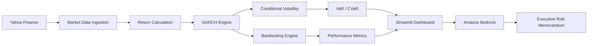

<div align="center">

# SGR-IA
### AI-Powered Financial Risk Management Platform


---

### Quantitative Risk Analytics • Artificial Intelligence • Volatility Forecasting • Financial Decision Support

*A next-generation financial risk management platform that combines econometric volatility modeling with Generative Artificial Intelligence to support institutional investment decisions.*

</div>

---

# Overview

SGR-IA (Sistema de Gestión de Riesgo con Inteligencia Artificial) is an enterprise-oriented financial risk management platform developed during a Hackathon to demonstrate how modern Artificial Intelligence can enhance quantitative finance.

Instead of relying exclusively on statistical indicators, the platform combines classical econometric techniques with Large Language Models to transform complex numerical outputs into executive-level financial reports understandable by portfolio managers, analysts and decision makers.

The project integrates volatility forecasting, market regime detection, Value at Risk estimation, Conditional Value at Risk, walk-forward backtesting and AI-generated institutional risk memorandums into a single interactive dashboard.

Unlike conventional dashboards that only display metrics, SGR-IA explains what those metrics mean and how they affect investment decisions.

---

# Problem Statement

Financial markets have become increasingly volatile due to macroeconomic uncertainty, geopolitical conflicts and rapidly changing monetary policies.

Traditional portfolio monitoring systems generally provide numerical indicators but leave the interpretation entirely to analysts.

This creates three important challenges:

- Delayed decision making during periods of market stress.
- Difficulty interpreting volatility forecasts.
- Lack of automated institutional reporting.

SGR-IA addresses these issues by combining quantitative modeling with Generative AI, enabling financial professionals to obtain technical indicators together with natural-language explanations and actionable insights.

---

# Solution

The platform performs the complete quantitative risk analysis pipeline.

Market prices are collected automatically.

↓

Logarithmic returns are calculated.

↓

A GARCH(1,1) volatility model with Student-t innovations is estimated using Maximum Likelihood Estimation.

↓

Conditional volatility is forecasted.

↓

Risk measures such as Value at Risk (VaR) and Conditional Value at Risk (CVaR) are calculated.

↓

A walk-forward backtesting engine evaluates strategy robustness without look-ahead bias.

↓

Amazon Bedrock (Claude) generates institutional-quality executive risk reports.

↓

All results are visualized through an interactive Streamlit dashboard.

---

# Main Features

## Quantitative Analytics

- GARCH(1,1) volatility forecasting
- Student-t innovation distribution
- Maximum Likelihood Estimation (MLE)
- Conditional volatility estimation
- Long-term variance estimation
- Persistence analysis (α + β)
- Information criteria (AIC / BIC)

---

## Risk Metrics

- Historical Returns
- Conditional Volatility
- Value at Risk (95%, 97.5%, 99%)
- Conditional Value at Risk
- Drawdown Analysis
- Market Regime Detection
- Tail Risk Analysis

---

## Backtesting Engine

- Walk-forward validation
- Expanding window methodology
- No look-ahead bias
- Dynamic exposure reduction
- Buy & Hold comparison
- Maximum Drawdown evaluation
- Strategy performance metrics

---

## Artificial Intelligence

The project integrates Amazon Bedrock to automatically generate professional institutional reports describing:

- Current market conditions
- Risk interpretation
- Volatility regime
- Portfolio recommendations
- Executive summary
- Technical explanation
- Investment considerations

This transforms raw statistical outputs into readable reports suitable for financial institutions.

---

# System Architecture



---

# Technology Stack

| Layer | Technology |
|---------|------------|
| Programming Language | Python 3.10+ |
| Dashboard | Streamlit |
| Econometrics | arch |
| Data Processing | Pandas |
| Numerical Computing | NumPy |
| Visualization | Plotly |
| Statistics | SciPy |
| AI Services | Amazon Bedrock |
| Cloud Storage | Amazon S3 |
| Deployment | Docker |
| Version Control | Git & GitHub |

---
# Project Structure

The project follows a modular architecture that separates quantitative modeling, data processing, visualization, cloud services and user interaction. This organization improves maintainability, scalability and future extensibility.

```text
Proyecto-Hackaton/
│
├── app.py                    # Main Streamlit application
├── requirements.txt          # Python dependencies
├── Dockerfile                # Container configuration
├── docker-compose.yml        # Multi-container deployment
├── .env.example              # Environment variables template
│
├── data/
│   ├── raw/
│   ├── processed/
│   └── cache/
│
├── models/
│   ├── garch.py
│   ├── forecasting.py
│   ├── risk_metrics.py
│   └── backtesting.py
│
├── services/
│   ├── bedrock.py
│   ├── s3.py
│   └── data_loader.py
│
├── utils/
│   ├── helpers.py
│   ├── plots.py
│   └── metrics.py
│
├── assets/
│   ├── images/
│   └── icons/
│
├── notebooks/
│
├── docs/
│
└── README.md
```

---

# Workflow

The platform follows an end-to-end quantitative finance pipeline.

```text
Historical Market Data
          │
          ▼
Data Cleaning & Validation
          │
          ▼
Log Return Computation
          │
          ▼
GARCH(1,1) Estimation
          │
          ▼
Volatility Forecast
          │
          ├───────────────┐
          ▼               ▼
Value at Risk        Backtesting
          │               │
          └───────┬───────┘
                  ▼
Risk Dashboard
                  │
                  ▼
Amazon Bedrock AI
                  │
                  ▼
Executive Financial Report
```

---

# Installation

## Clone the repository

```bash
git clone https://github.com/Camxeroth/Proyecto-Hackaton.git

cd Proyecto-Hackaton
```

---

## Create a virtual environment

Linux / macOS

```bash
python -m venv venv

source venv/bin/activate
```

Windows

```bash
python -m venv venv

venv\Scripts\activate
```

---

## Install dependencies

```bash
pip install -r requirements.txt
```

---

# Environment Variables

Create a `.env` file in the root directory.

Example:

```env
AWS_ACCESS_KEY_ID=xxxxxxxxxxxxxxxx
AWS_SECRET_ACCESS_KEY=xxxxxxxxxxxxxxxx
AWS_DEFAULT_REGION=us-east-1

BEDROCK_MODEL=anthropic.claude

S3_BUCKET=your_bucket_name
```

---

# Running the Project

Launch the Streamlit application.

```bash
streamlit run app.py
```

The dashboard will be available at:

```
http://localhost:8501
```

---

# Docker Deployment

Build the image.

```bash
docker build -t sgr-ia .
```

Run the container.

```bash
docker run -p 8501:8501 sgr-ia
```

Or simply execute:

```bash
docker-compose up
```

---

# Dashboard Modules

The application has been designed using independent analytical modules.

## Market Overview

Provides a consolidated view of market behavior, allowing users to identify recent movements and overall asset performance.

---

## Volatility Forecasting

Implements a GARCH(1,1) model with Student-t innovations to estimate conditional volatility and forecast future market uncertainty.

Main outputs include:

- Conditional Volatility
- Long-run Variance
- Persistence
- Forecast Horizon
- Confidence Intervals

---

## Risk Analysis

Computes institutional risk indicators commonly used in quantitative finance.

Included metrics:

- Value at Risk (VaR)
- Conditional Value at Risk (CVaR)
- Historical Volatility
- Expected Shortfall
- Tail Risk

---

## Backtesting

Evaluates investment strategies through a walk-forward validation framework.

Performance indicators include:

- Portfolio Return
- Buy & Hold Benchmark
- Maximum Drawdown
- Annualized Return
- Volatility
- Sharpe Ratio
- Hit Ratio

---

## AI Risk Assistant

Amazon Bedrock generates professional financial analyses directly from the calculated metrics.

The generated reports typically include:

- Executive Summary
- Market Overview
- Risk Assessment
- Portfolio Interpretation
- Strategic Recommendations
- Future Outlook

---

# Performance Highlights

The implemented methodology provides several advantages over traditional monitoring systems.

| Feature | Benefit |
|----------|----------|
| GARCH Modeling | Captures volatility clustering |
| Student-t Distribution | Better tail risk estimation |
| Walk-forward Validation | Prevents look-ahead bias |
| Amazon Bedrock | Institutional-quality reports |
| Streamlit | Interactive visualization |
| Modular Design | Easy maintenance and scalability |
| Cloud Storage | Secure persistence through Amazon S3 |

---

# Future Roadmap

The platform has been designed with scalability in mind.

Planned improvements include:

- Multi-asset portfolio optimization
- Monte Carlo simulations
- Stress testing scenarios
- Real-time market streaming
- Options pricing models
- Credit risk estimation
- Reinforcement Learning strategies
- Explainable AI (XAI)
- Automatic anomaly detection
- Kubernetes deployment
- CI/CD pipelines
- REST API for institutional integration

---

# Screenshots

Replace these placeholders with project images.

```text
assets/images/dashboard.png

assets/images/forecast.png

assets/images/backtesting.png

assets/images/bedrock-report.png
```

Then embed them as follows:

```markdown
## Dashboard


---

## Volatility Forecast


---

## Backtesting


---

## AI Report


```

---
# Mathematical Foundation

The analytical engine is based on the Generalized Autoregressive Conditional Heteroskedasticity (GARCH) framework, one of the most widely adopted models in quantitative finance for modeling time-varying volatility.

The implemented GARCH(1,1) model estimates conditional variance using historical innovations and previous conditional variances, enabling dynamic volatility forecasting under changing market conditions.

The project incorporates Maximum Likelihood Estimation (MLE) with Student-t innovations to improve robustness against heavy-tailed financial return distributions.

Key concepts implemented include:

- Volatility Clustering
- Conditional Variance
- Maximum Likelihood Estimation
- Heavy-Tailed Distributions
- Tail Risk Modeling
- Forecast Persistence
- Risk Forecasting

---

# Security

Security considerations were incorporated throughout the application architecture.

Implemented practices include:

- Environment variables for sensitive credentials
- AWS IAM authentication
- Secure Amazon Bedrock integration
- Amazon S3 cloud storage
- Separation of business logic
- Modular architecture
- Input validation
- Error handling
- Reproducible environments
- Containerized deployment

Future improvements include:

- OAuth2 authentication
- JWT authorization
- Role-Based Access Control (RBAC)
- Secrets Manager integration
- HTTPS reverse proxy
- Automated vulnerability scanning

---

# Scalability

The architecture was designed to support future institutional deployments.

Possible extensions include:

- Multi-user support
- Cloud-native deployment
- Distributed computing
- GPU acceleration
- Kubernetes orchestration
- Automated retraining
- CI/CD integration
- REST API services
- Microservices architecture

---

# Testing Strategy

The project follows a layered validation strategy.

## Data Validation

- Missing values
- Duplicate records
- Invalid observations
- Time index consistency

---

## Model Validation

- Log-likelihood optimization
- Convergence verification
- Residual diagnostics
- Volatility persistence
- Information criteria comparison

---

## Strategy Validation

- Walk-forward backtesting
- Benchmark comparison
- Drawdown analysis
- Stability evaluation
- Performance consistency

---

# Performance Characteristics

| Category | Description |
|-----------|-------------|
| Data Processing | Optimized with Pandas and NumPy |
| Econometric Estimation | Maximum Likelihood Optimization |
| Visualization | Interactive Plotly Rendering |
| AI Inference | Amazon Bedrock |
| Storage | Amazon S3 |
| Deployment | Docker Ready |
| Extensibility | High |
| Maintainability | High |

---

# Potential Applications

Although developed during a Hackathon, the platform has practical applications across multiple sectors.

## Financial Institutions

- Portfolio monitoring
- Market risk assessment
- Executive reporting
- Asset allocation support

---

## Investment Funds

- Volatility forecasting
- Dynamic exposure management
- Risk-adjusted investment decisions

---

## Universities

- Quantitative finance education
- Econometrics laboratories
- AI applications in finance
- Financial engineering research

---

## FinTech Companies

- Automated risk analysis
- AI-powered financial assistants
- Investment advisory systems
- Cloud-native financial analytics

---

# Contributing

Contributions are welcome.

If you would like to improve the project:

1. Fork the repository.
2. Create a feature branch.

```bash
git checkout -b feature/my-feature
```

3. Commit your changes.

```bash
git commit -m "Add new feature"
```

4. Push your branch.

```bash
git push origin feature/my-feature
```

5. Open a Pull Request.

---

# Coding Standards

The project follows modern Python development practices.

- PEP 8
- Type Hints
- Modular Design
- Reusable Components
- Separation of Concerns
- Clean Code Principles
- Documentation-Oriented Development

---

# License

This project is distributed under the **MIT License**.

You are free to use, modify and distribute the software provided that the original copyright notice and license are included.

For more information, see the `LICENSE` file.

---

# Authors

## Project Lead

**Camxeroth**

Data Science & Artificial Intelligence

Specialized in:

- Machine Learning
- Financial Risk Modeling
- Artificial Intelligence
- Quantitative Finance
- Data Engineering

GitHub

```
https://github.com/Camxeroth
```

---

# Acknowledgements

This project was inspired by the intersection of quantitative finance, cloud computing and artificial intelligence.

Special thanks to the communities and technologies that made this work possible.

- Python Software Foundation
- Streamlit
- NumPy
- Pandas
- Plotly
- SciPy
- ARCH
- Amazon Web Services
- Amazon Bedrock
- GitHub

---

# Repository Statistics

| Property | Value |
|-----------|--------|
| Language | Python |
| Architecture | Modular |
| AI Integration | Amazon Bedrock |
| Econometric Model | GARCH(1,1) |
| Deployment | Docker |
| Dashboard | Streamlit |
| Cloud | AWS |
| Storage | Amazon S3 |

---

# Citation

If you use this repository in academic work, please cite it as follows.

```bibtex
@software{camxeroth_sgr_ia,
  author       = {Camxeroth},
  title        = {SGR-IA: AI-Powered Financial Risk Management Platform},
  year         = {2026},
  publisher    = {GitHub},
  url          = {https://github.com/Camxeroth/Proyecto-Hackaton}
}
```

---

<div align="center">

## SGR-IA

**Artificial Intelligence for Quantitative Financial Risk Management**

Built with Python, Streamlit, GARCH Models and Amazon Bedrock.

---

*"Transforming financial data into intelligent decisions."*


</div>
