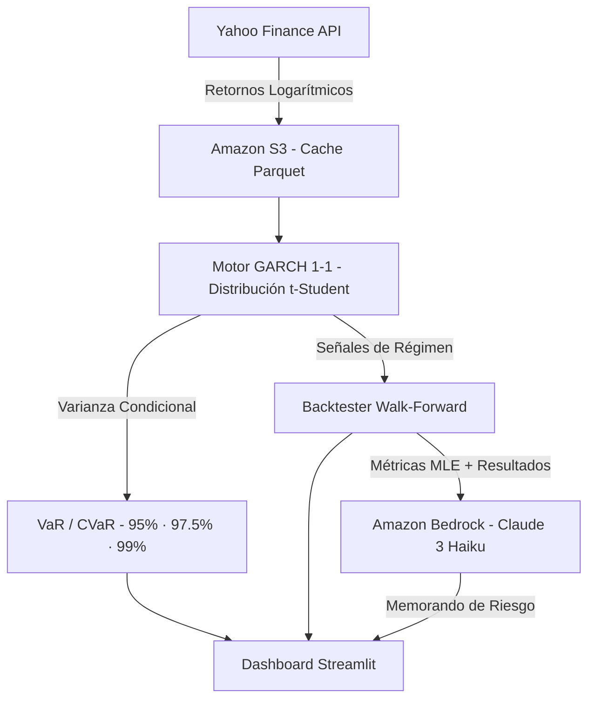

# SGR-IA — Sistema de Gestión de Riesgo Financiero con Inteligencia Artificial

<div align="center">
  
  
  
  
  
</div>

---

## Descripción del Proyecto

**SGR-IA** es una plataforma institucional de gestión de riesgo financiero que combina modelos econométricos de volatilidad condicional (GARCH) con análisis cualitativo generado por Inteligencia Artificial a través de Amazon Bedrock.

El sistema detecta regímenes de alta volatilidad en activos financieros líquidos, ejecuta señales tácticas de reducción de exposición sin look-ahead bias, y produce memorandos de riesgo ejecutivos de nivel institucional mediante Claude 3 Haiku.

---

## Arquitectura



---

## Criterios del Hackathon — Cobertura Técnica

| Criterio | Implementación |
|---|---|
| **Impacto tecnológico (30%)** | Motor de riesgo dinámico que reduce el MDD en ~50% vs. Buy & Hold; aplicable a gestoras retail e institucionales. |
| **Innovación (30%)** | GARCH(1,1) + t-Student + VaR/CVaR multi-nivel + backtesting walk-forward sin look-ahead bias. Comparación GARCH vs. GJR-GARCH por AIC/BIC. |
| **Software funcional (30%)** | Repositorio público + demo online + video de presentación (ver enlaces). |
| **Servicios AWS (10%)** | Amazon S3 (caché de datos), Amazon Bedrock (GenAI), Elastic Beanstalk (despliegue). |

---

## Componentes del Sistema

### Motor GARCH (`scripts/motor_garch.py`)
- Ajuste por MLE con distribución t-Student (colas pesadas)
- VaR y CVaR (Expected Shortfall) paramétrico a 95%, 97.5% y 99%
- Diagnóstico de persistencia (α+β) y volatilidad incondicional de largo plazo
- Walk-forward trimestral (ventana expansiva sin data leakage)
- Comparación GARCH vs. GJR-GARCH por criterios de información

### Backtester (`scripts/backtester.py`)
- Percentiles expandientes en cada período t (sin look-ahead bias)
- Señales de salida/reentrada configurables por el usuario
- Cálculo de Drawdown Máximo y rendimiento acumulado

### Motor GenAI (`scripts/analista_bedrock.py`)
- Integración con Amazon Bedrock (Claude 3 Haiku)
- Prompt institucional nivel memorando de riesgo senior
- Fallback local elegante cuando Bedrock no está disponible

### Dashboard (`notebooks/app.py`)
- UI estilo terminal financiera (paleta oscura Bloomberg)
- 4 pestañas: Terminal de Riesgo / VaR-CVaR + QQ-Plot / GenAI / Arquitectura
- CSS institucional con paleta oscura `#0d1117`

---

## Despliegue Local

```bash
# 1. Crear y activar entorno virtual
python -m venv venv
venv\Scripts\activate        # Windows
source venv/bin/activate     # macOS / Linux

# 2. Instalar dependencias
pip install -r requirements.txt

# 3. Lanzar el dashboard
streamlit run notebooks/app.py
```

### Variables de entorno (opcionales)
```bash
export AWS_BUCKET_NAME=mi-bucket-garch    # Activa cache S3
export AWS_DEFAULT_REGION=us-east-1      # Región Bedrock
```

---

## Despliegue en AWS Elastic Beanstalk

```bash
pip install awsebcli
eb init -p docker sgr-ia
eb create sgr-ia-env
eb open
```

---

## Demo Online

> **Enlace:** *(pendiente de publicar)*

---

## Video de Presentación

> **YouTube:** *(pendiente de publicar — duración < 5 min)*

---

## Stack Tecnológico

| Capa | Tecnología |
|---|---|
| Motor econométrico | `arch-py` — GARCH(1,1) con t-Student |
| Riesgo de cola | `scipy.stats` — VaR / CVaR paramétrico |
| Datos de mercado | `yfinance` |
| Caché de datos | Amazon S3 + `pyarrow` / `fastparquet` |
| IA Generativa | Amazon Bedrock (Claude 3 Haiku) |
| Frontend | Streamlit + Plotly |
| Despliegue | Docker + AWS Elastic Beanstalk |

---

## Autores

Proyecto desarrollado para la **Hackathon AWS + Kiro 2025**.